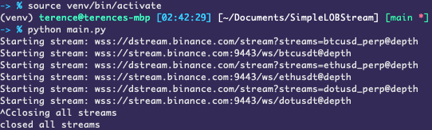
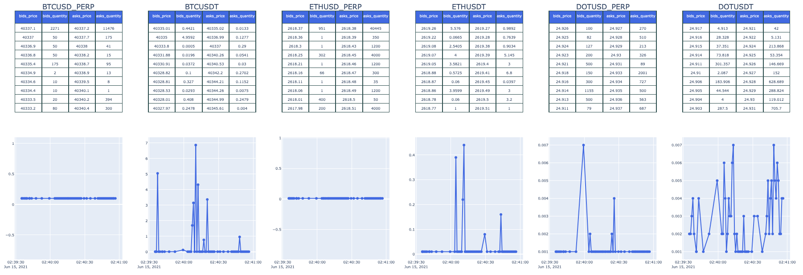

# SimpleLOBStream

## Installation

Use the package manager [pip](https://pip.pypa.io/en/stable/) to install.

```bash
# set python version to 3.8.0 or 3.8.*, or use something like conda.
pyenv local 3.8.0

# install packages in a virtualenv/conda.
python -m venv venv
source venv/bin/activate
pip install -r requirements.txt
```


## Starting redis
```bash
# start redis server, required for the plotly dashboard.
brew install redis
redis-server
```

## Start OrderBook stream and dashboard
```bash
# start streaming order book data.
python main.py

# start the dashboard to display the spread/order book data by opening another command line window.
python monitor.py
```

## Sample output from closing the OrderBook stream via KeyboardInterrupt.


## Sample dashboard display


